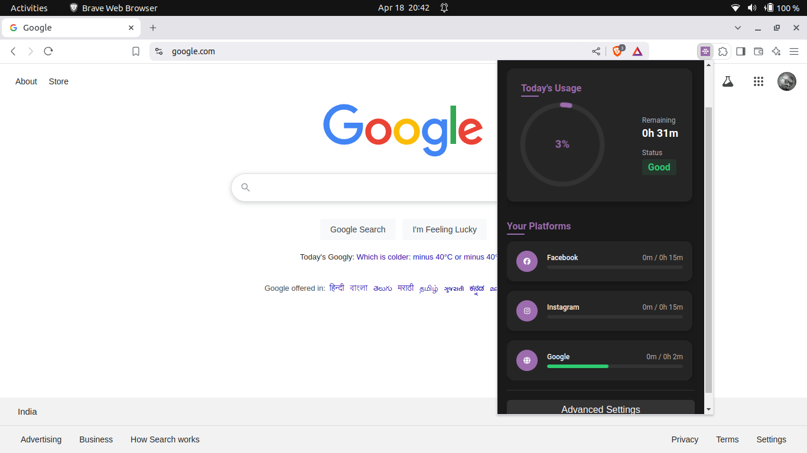
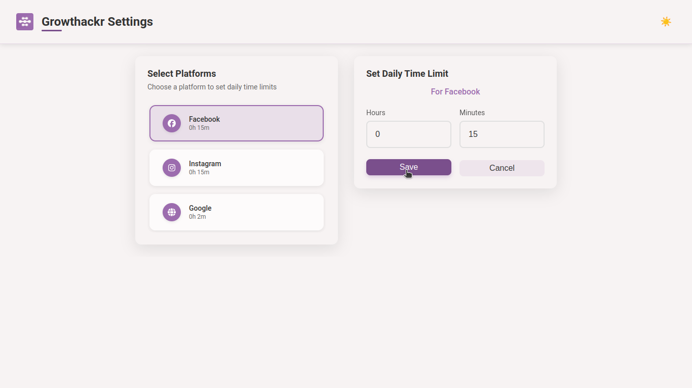
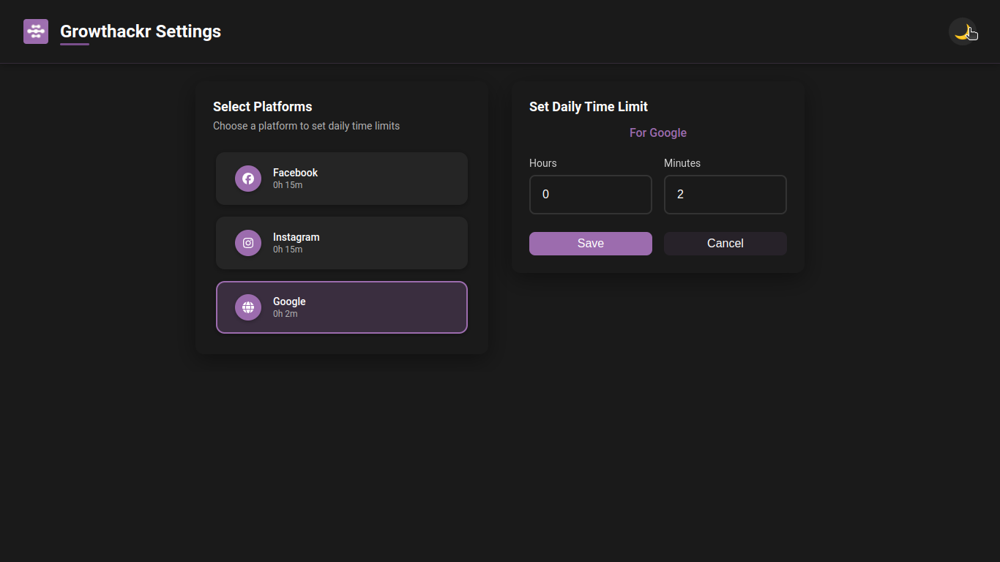
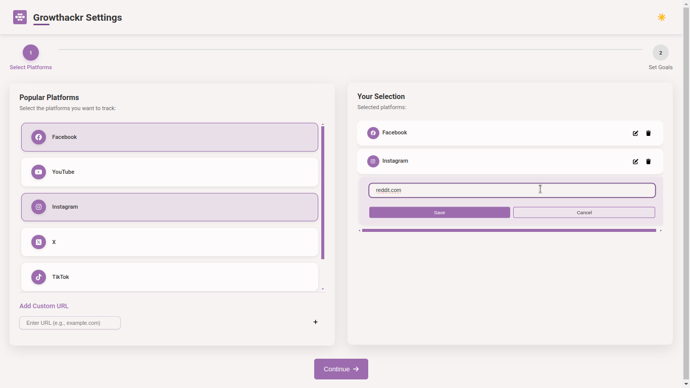
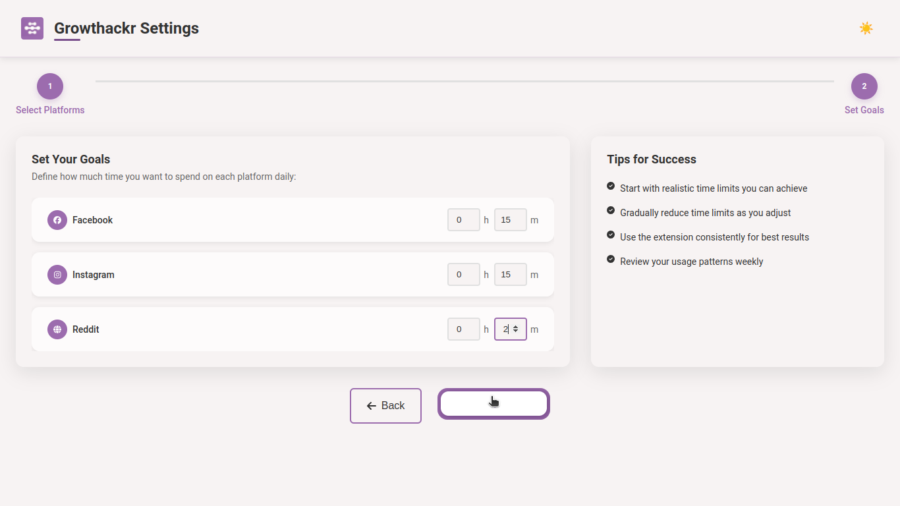
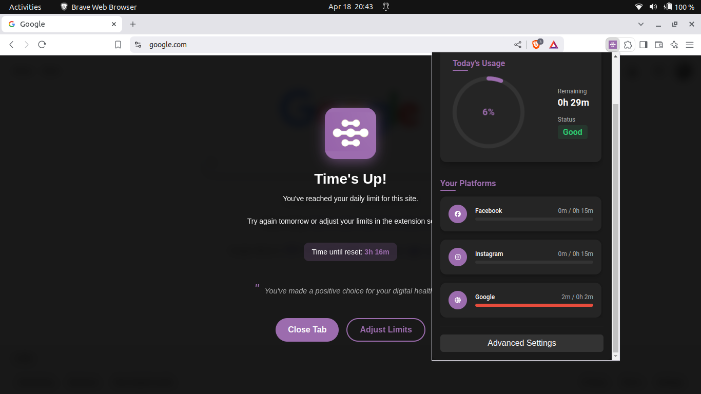

# Growthackr

<!-- 📦 Project Info -->
[](LICENSE)
[](https://github.com/NIKHIL0VERMA/Growthackr/releases)

<!-- 🔽 Downloads -->
[](https://github.com/NIKHIL0VERMA/Growthackr/releases/latest/download/Growthackr-Stable.zip)
[](https://github.com/NIKHIL0VERMA/Growthackr/releases/latest/download/Growthackr-Debug.zip)

<!-- 📣 Promotion -->
[](https://www.producthunt.com/products/growthackr)

<!-- 📚 Docs -->
[](https://nikhil0verma.github.io/Growthackr/)

**Track. Limit. Grow.**  

Build on KISS principle. \
Growthackr helps you reclaim control of your time online by monitoring and limiting your usage on platforms like Facebook, YouTube, and Instagram — all from a clean, intuitive Chrome extension.

---
---

## 📦 Usage

1. Click the Growthackr icon in your browser
2. Scroll down and click `Advanced Settings`
2. Set time limits for each platform
3. Use your browser — Growthackr runs silently in the background
4. You can check usage from dashboard
5. Platforms will be blocked when your time is up

## 📸 Preview & Demo

### Demo and installation
[](https://youtu.be/3ACxSlxko9M)

### Dashboard (Dark Mode)


### Options Page (Light & Dark)
<p float="left">
  
  
</p>

### Welcome Flow (Light Theme)
<p float="left">
  
  
</p>

### Blocking Screen

---

## 🚀 Installation

### Option 1: Manual Install from GitHub Release
You can manually install Growthackr using either of the following builds:

- 🧑‍🎓 **[Stable Build](https://github.com/NIKHIL0VERMA/Growthackr/releases/latest/download/Growthackr-Stable.zip)** — for everyday users  
- 🧑‍💻 **[Debug Build](https://github.com/NIKHIL0VERMA/Growthackr/releases/latest/download/Growthackr-Debug.zip)** — for checking log to report bug

### 🛠 Installation Steps (Both Builds)
1. Go to the **[Releases](https://github.com/NIKHIL0VERMA/Growthackr/releases)** tab.
2. Download the latest choose `.zip` file.
3. Extract the ZIP to a folder.
4. Open Chrome and go to `chrome://extensions/`
5. Enable **Developer Mode** (toggle switch in the top right).
6. Click **"Load unpacked"** and select the extracted folder.

Need installation help ? \
Follow demo after extracting zip

### Option 2: Chrome Web Store

If got enough users or stars, I may release it to chrome web store

---

## 🧠 Features

- ⏳ **Time Tracking** – Monitor daily usage for supported platforms or add you custom url
- ⚙️ **Custom Limits** – Set your own daily screen time goals for each platform
- 🎨 **Theme Support** – Choose between Light and Dark themes to match your style
- 💎 **Simple UI** – Clean, distraction-free interface  

---

## 📦 Usage

1. Click the Growthackr icon in your browser
2. Scroll down and click `Advanced Settings`
2. Set time limits for each platform
3. Use your browser — Growthackr runs silently in the background
4. You can check usage from dashboard
5. Platforms will be blocked when your time is up

---

## 📚 Documentation

Looking to dive deeper into the codebase, understand architecture, or contribute?

Check out the full developer documentation here:  
👉 [https://nikhil0verma.github.io/Growthackr/](https://nikhil0verma.github.io/Growthackr/)

---

## 👨‍💻 Development Setup

### 1. Clone the Repository
```bash
git clone https://github.com/NIKHIL0VERMA/Growthackr.git
cd Growthackr
```

### 2. Install Dependencies
```bash
npm install
```

### 3. Build the Project
```bash
npm run build
```

### 4. Load in Chrome
- Go to `chrome://extensions/`
- Enable **Developer Mode**
- Click **Load Unpacked**
- Select the `dist/` folder

---

## 🧪 Tech Stack


---

## 🤝 Contributing

We welcome contributions!

### How to Contribute

1. Fork the repo
2. Create a new branch (`git checkout -b your-feature`)
3. Make changes and commit (`git commit -m "Add feature"`)
4. Push your branch and open a Pull Request

### Guidelines

- Match the existing style
- Write tests where applicable
- Update docs when needed

---

## 🌱 Roadmap

- Add advance analytics dashboard
- Mobile companion app
- Sync settings across devices
- Smart, AI-powered limit suggestions

---

## 📄 License

This project is licensed under the [MIT License](LICENSE).

---

## 📬 Contact

**Author**: [Nikhil Verma](mailto:nikhil2003verma@gmail.com)  
🐛 Found a bug? Open an [issue](https://github.com/NIKHIL0VERMA/Growthackr/issues)  
💬 Want to chat? Ping me on [Twitter](https://twitter.com/nikhil0verma)
